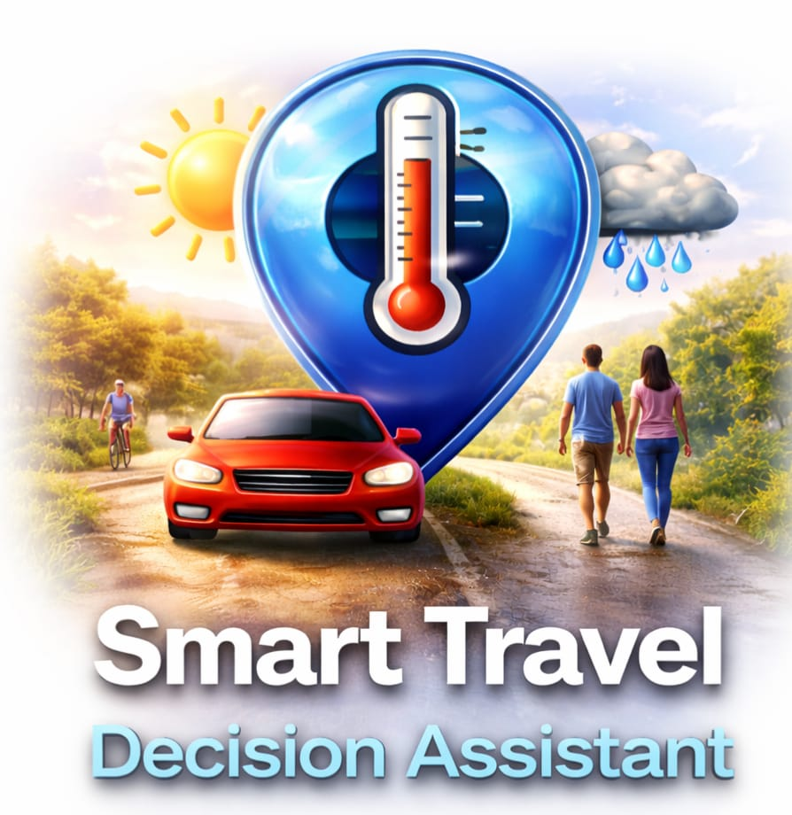

# Smart Travel AI

---

## 🌍 Project Overview
Hey! This is a simple but powerful tool called **Smart Travel AI**. 

Have you ever wondered if you should take your bike or a car because of the weather? This app solves that! It takes your city's live weather data and asks a smart AI what the best way to travel is. It looks at things like how hot it is, if it's going to rain, or if it's too windy. 

Instead of just looking at numbers, you get a human-like recommendation and a plan for your day. It’s all about making sure you have a smooth and safe journey every time you step out.

---

## 🛠️ Tech Stack

| Category | Technology | Usage |
| :--- | :--- | :--- |
| **Frontend** | React.js | Minimalist UI & Dashboard |
| **Styling** | Tailwind CSS | Responsive & Professional Design |
| **Backend** | Python | Data processing & API Logic |
| **AI Brain** | Groq API (Llama 3.1) | Real-time travel decisions |
| **Weather** | OpenWeatherMap | Accurate live weather updates |
